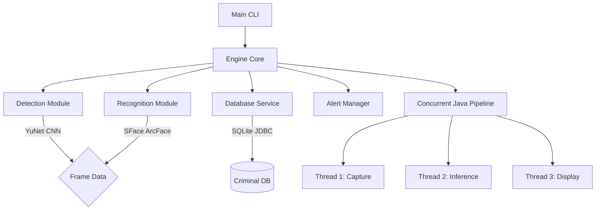

# 🕵️ Criminal Face Detection System (CFDS)

[](https://openjdk.java.net/)
[](https://opencv.org/)
[](https://sqlite.org/)

**A high-performance, production-grade Java pipeline for real-time facial recognition and criminal database matching.**

> [!IMPORTANT]
> This project was fully engineered in Java to demonstrate mastery of **JNI Native Call Bindings (JavaCV)**, **Multi-threaded Producer-Consumer Concurrency**, and **JDBC Data Persistence**.

---

## 🌟 Recruiter Highlights: Why This Stands Out

*   **State-of-the-Art Deep Learning**: Uses the **YuNet CNN** for detection and **SFace (ArcFace)** for 128-dimensional embedding generation. 
*   **Asynchronous High-Throughput Pipeline**: Employs a robust **3-thread Producer-Consumer architecture** using Java's `BlockingQueue` and `Thread` management. The camera capture is never throttled by heavy DNN inference.
*   **Privacy-by-Design**: Raw facial images are converted into mathematical float-point vectors (embeddings). Only these secure vectors are stored in the database.
*   **JavaCV Ecosystem Mastery**: Seamlessly integrates native C++ OpenCV libraries directly into the JVM without requiring complex environment path setups.

---

## 🏗️ System Architecture

The system is designed with a strictly modular approach.



### Technical Stack & Dependencies
| Component | Technology | Rationale |
| :--- | :--- | :--- |
| **Language** | Java 17 | Enterprise stability, memory safety, and modern thread scaling. |
| **Inference Engine** | JavaCV (OpenCV DNN) | High-speed JVM native bindings mapping directly to C++ memory structures. |
| **Database** | SQLite3 (JDBC) | Local persistence with Write-Ahead Logging (WAL). |
| **Serialization** | Gson | Flexible, high-performance configuration management. |
| **Build System** | Apache Maven | Automated dependency resolution for native platform DLLs. |

---

## 🚀 Getting Started

Follow these steps to set up, build, and run the project from scratch.

> [!TIP]
> You do **not** need to install Maven or manually configure OpenCV! The project includes an automated PowerShell script that handles everything.

### 1. Build and Compile
Open a standard Windows **PowerShell** prompt and execute the build script:

```powershell
# Navigate to project director
cd d:\CFDS

# Execute the automated builder
.\build_and_run.ps1
```

> [!IMPORTANT]
> Because the local C: drive is full, all native libraries and temporary files are redirected to the D: drive. The build script handles this automatically for you.

---

## 💻 Usage & CLI Modes

To run the system manually, you **must** first set the environment variable in your terminal session to ensure all engines and database drivers load from the D: drive:

```powershell
$env:JAVA_TOOL_OPTIONS = "-Dorg.bytedeco.javacpp.cachedir=`"D:\CFDS\.javacpp_cache`" -Djava.io.tmpdir=`"D:\CFDS\temp`""
```

Once that is set, you can use the standard commands below:

### 1. Criminal Enrollment (Registration)
The database starts empty. You must first enroll a face so the system has a reference to match against.
```bash
java -jar target/cfds-1.0-SNAPSHOT-jar-with-dependencies.jar enroll --name "Subject Name" --id "C01" --crime "Infiltration Testing" --input "C:/path/to/face_image.jpg"
```

### 2. Live Surveillance
Start the real-time detection pipeline using your webcam. The system will now recognize any faces enrolled in Step 1.
```bash
java -jar target/cfds-1.0-SNAPSHOT-jar-with-dependencies.jar live --device 0
```

### 3. Image Analysis
Process a single static image and save the annotated result:
```bash
java -jar target/cfds-1.0-SNAPSHOT-jar-with-dependencies.jar image --input test_snapshot.jpg --output recognition_result.jpg
```

### 4. System List & Deletion
View all registered criminals or remove a record:
```bash
java -jar target/cfds-1.0-SNAPSHOT-jar-with-dependencies.jar list
java -jar target/cfds-1.0-SNAPSHOT-jar-with-dependencies.jar delete --id "C01"
```
